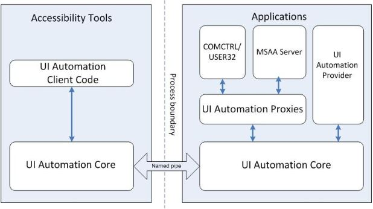
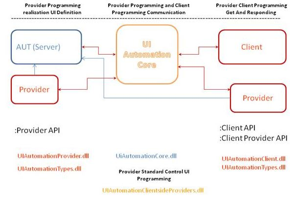

## <font color=#009900>Windows图形界面程序的自动测试</font>  

---
### <font color=#009900>Windows图形界面程序的自动化测试</font>  
- Windows GUI程序自动化的历史  
在最早的Windows开发中是没有自动化测试的概念的。1997年微软在操作系统中集成了MSAA(Microsoft Active Accessibility，以下简称MSAA)组件，但是微软开发MSAA组件的初衷并不是为了自动化测试，而是提供了一套接口，让开发者们可以方便的开发残疾人士辅助软件，比如读屏软件等。伴随着自动化测试的应用越来越广泛，微软正视了自动化测试的需求，在MSAA的基础上，对其重新封装设计并实现了UI Automation（以下简称UIA）的类库(.NET)。  
从Win7系统开始的后续Windows操作系统都整合了UIA的所有功能。  
尽管MSAA和UIA是两种不同的技术，但基本原理是相似的。两种技术的目标都是公开Windows应用程序中UI元素的信息。MSAA和UIA都将UI对象模型公开为以“桌面”为根节点的树型结构。MSAA将单个UI元素表示为可访问对象，而UIA将它们表示为自动化元素。两者都将自动化程序称为客户端。但是，MSAA把目标GUI程序称为“可访问的server”，而UIA则将其称为“provider”。  
MSAA技术发布于十几年前Windows95盛行的年代，它无法操作例如Web浏览器这样复杂的程序，而UIA则可以。  
MSAA技术虽然访问的接口十分简单，但是它对目标程序的控制范围不足，因此微软推荐在开发新的目标程序时采用UIA。  

- 自动化方案  
 - 利用Windows API  
 通过FindWindow和EnumWindows来查找到窗口句柄，然后再调用其它 API(GetWindowText，GetWindowRect，GetWindowLong等)来获取窗口属性，以此来查找控件。如果遇到非标准控件（自定义控件），这种方式基本上完全束手无策。当然也可以采用暴力破解（计算坐标）的方法，但是这种方案非常之不稳定，会导致后期超高的维护成本，从软件工程角度来说完全不推荐。  
 - 利用MSAA  
 理论上可行，但能获取的控件信息只比直接利用Windows API多那么一点点，对于支持自动化测试来说完全不够。微软推出WPF之后，控件属性更为丰富，采用MSAA也就越来越力不从心。  
 - 利用UIA  
 这是现在微软力推的方式，大部分新开发的Windows图形界面程序都会积极的支持UIA，尤其实在Windows7之后，UIA修缮得更为完备，为自动化客户端程序创造了良好的条件。  

### <font color=#009900>UI Automation</font>    
- UIA程序的架构  
  
（图一）UI Automation架构（用户视图）  
  
（图二）UI Automation实现（开发视图）  

- 使用UIA统一自动化程序的困难  当使用UIA客户端程序操作provider程序时，UIA会给provider程序发送WM_GETOBJECT消息，如果provider程序处理WM_GETOBJECT消息（实现了UIA Provider），并调用了函数UiaReturnRawElementProvider，此程序就支持UIAutomation。该函数的参数IRawElementProviderSimple就是UIA Provider，它包含了控件的各种信息，如Name，ClassName，ContorlType，坐标等。UIA客户端程序根据程序返回的IRawElementProviderSimple能够遍历程序的控件，并可以得到控件的各种属性，也就能进行自动化操作。  
并不是所有GUI程序都会处理WM_GETOBJECT，所以如果发现UIA客户端程序不能识别某些GUI程序的控件，这很可能并非UIA本身的问题，而是GUI程序没有处理WM_GETOBJECT或根本没有实现UIA Provider。  
总结一下，UIA并非万能钥匙，如果Provider程序不提供支持，则无法使用UIA，因此考虑使用UIA制作一个统一的框架来对所有图形界面程序进行自动控制是不现实的。由于对于Windows图形界面程序没有统一的外部操控接口，因此当一个系统包含Windows图形界面应用程序时，该系统能否彻底实现自动化，怎样实现自动化，都需要进行个案的分析（Win32 API，MSAA还是UIA），这也是Windows图形界面程序自动化的困难之处！  

- UIA的辅助工具  
UIA的核心是UIAutomationCore.dll这个COM，它位于“C:\WINDOWS\system32\uiautomationcore.dll”，此Dll在Windows XP以上的版本都存在。  
如果使用Python调用UIA，需要使用到的Windows SDK位于“C:\Program Files (x86)\Microsoft SDKs\Windows\v7.0\Include”。  
查找UIA自动化元素时有一些辅助工具，这里推荐UISpy和inspect。这两个文件都是绿色版的，不需要安装。前者只能查看UIA的树形结构，后者不但能查找UIA，还能查找MSAA的树形结构。  

- UIA基本概念  
在UIA中所有的UI元素都以AutomationElement对象形式来表述，这些元素都串在一个树形结构中，其root节点为Desktop，UISpy中有多种工具来观察这个树形结构，包括原始视图、内容试图、控件视图等。  
UIA中有两个关键的概念，一是控件类型（ControlType）：有38种；二是控件模式（ControlPatterns）：如何操作该控件，包括属性、方法、事件、关系等。  
UIA的使用有两个关键步骤，第一步是找到要使用的控件，第二步是查找并执行控件的方法。  
控件识别可以借助以下途径： 
 - AutomationId   
 - ControlType   
 - Name   

### <font color=#009900>PyWin32(Win32All)</font>    
- PyWin32是什么？  
PyWin32是从以前的Win32All项目发展而来，他是一个软件包，可以用于使用Python访问Win32 API和COM。  
PyWin32的主要贡献者为：Mark Hammond和ActiveState。  
PyWin32符合Python Software Foundation License。  
PyWin32本来的目的并非用于控制GUI程序，但是因为它为Python提供了全面的Win32 API，因此它可以作为在Python环境下制作GUI自动化测试程序的底层基础设施。  

- Win32 API是什么？  
Windows操作系统是闭源的，它提供给程序员访问的API接口称为Windows API。 
Windows API有不同的版本：Win16、Win32、Win32s、Win64、WinCE。Win32是从Win95开始推出，经历的期间最长，影响最大。  
Win32的核心动态链接库包括：kernel32.dll、user32.dll、gdi32.dll。  
Win32可分为以下几个主要类别：  
 - Base Services  
 - Advanced Services  
 - GUI  
 - Common Dialog Box Library  
 - Common Control Library  
 - Windows Shell  
 - Network Services  

- 如何安装PyWin32？  
安装pywin32直接用pip安装容易失败，不如直接从下列网址下载：  
[pywin32下载站点](https://github.com/mhammond/pywin32/releases)  
下载那个和自己python版本相同，和OS位数相同的程序，然后安装即可。  
然后爱需要安装win32api。  
```shell
python.exe Scripts/pywin32_postinstall.py -install
```
如果全部安装成功的话，在python命令行界面应该可以导入下列的包。  
```python
import win32api
import win32con
```

### <font color=#009900>Python的comtypes包</font>    
- comtypes是什么？  
虽然利用PyWin32可以方便的访问Win32 API，但是它无法访问Windows的COM组件。COM组件会提供一些在基本的Win32 API以外的专门服务，这些服务不能通过Win32 API接口访问，从Python访问它们需要借助comtypes包。   
因为UIA是基于COM实现的，因此在访问UIA时需要用到comtypes包。  

- 如何获取COM对象？  
comtypes.client中有三种方式获取COM对象：  
 - CreateObject：创建COM对象  
 - COGetObject：创建COM对象  
 - GetActiveObject：获取一个已经存在的COM对象  
这三个方法都会返回一个COM接口指针。  

- COM对象事件  
有三个方法可将事件和事件关联起来：  
 - GetEvents  
 - ShowEvents  
 - PumpEvents  

- comtypes类型库（Typelibraries）  
GetModule方法可以为某个COM对象生成一个Python类型库封装。    

*注意不要在python3.7.6至3.8.1使用comtypes，这个版本的python中，libffi中缺少一个功能，该功能恰好是ctypes用于Python/C集成的调用约定处理库。该问题在python3.8.2中应该被修复。参考[https://github.com/enthought/comtypes/issues/202](https://github.com/enthought/comtypes/issues/202)。  

### <font color=#009900>Pywinauto</font>   
pywinauto是一个用纯Python编写的GUI自动化库，它底层采用了PyWin32，comtypes这两个库。  
基于pywinauto开发自己的GUI自动化测试工具是一个可行的选择。  

pywinauto的安装   

### <font color=#009900>Python版的UIA库</font>    
- Python下安装UIAutomation   
网友YinKaisheng为了在Python下使用UIA，制作了一套Python下的UIA接口库，其名称就叫UIAutomation，这非常容易和UIA本身的名称搞混！  
YinKaisheng这个库的源代码对于研究Python下的UIA编程有非常大的参考价值，在此向他表示致敬！  

- Python下安装UIAutomation   
```shell
pip install uiautomation
```

### <font color=#009900>腾讯的QT4C</font>   
- QT4C的安装  
安装QT4C，并运行其Demo（前提是要安装pywin32）：  
```shell
pip install qtaf
pip install qt4c
git clone https://github.com/qtacore/QT4CDemoProj.git
python manage.py runscript demotest/hello.py
```
腾讯的QT4C测试框架很不稳定，尤其是注释多用中文，对于多语言环境的OS适应性非常差。  

## <font color=#009900>参考资料</font>   
[Windows GUI自动化测试技术的比较和展望](https://blog.csdn.net/vagabond1/article/details/5648902)   
[Microsoft UI Automation手册](https://docs.microsoft.com/en-us/dotnet/framework/ui-automation/)  
[UI Automation客户端程序开发手册](https://docs.microsoft.com/en-us/windows/win32/winauto/uiauto-clientportal)  
[UIA常数定义](https://docs.microsoft.com/en-us/windows/win32/winauto/uiauto-entry-constants)   
[UIA查询条件生成](https://docs.microsoft.com/en-us/windows/win32/api/uiautomationclient/nf-uiautomationclient-iuiautomation-createpropertyconditionex)   
[构建UI Automation客户端程序](https://www.codemag.com/article/0810122/Creating-UI-Automation-Client-Applications)  
[UI Automation库用于UI自动化测试](https://www.cnblogs.com/coderzh/archive/2009/11/14/1603109.html)   
[yinkaisheng的uiautomation module项目](https://github.com/yinkaisheng/Python-UIAutomation-for-Windows)   
[开着拖拉机：使用UI Automation实现自动化测试](https://www.cnblogs.com/kangyi/archive/2009/09/08/1549411.html)  
[Pywinauto官网](https://pywinauto.github.io/)  
[comtypes使用手册](https://pythonhosted.org/comtypes/)  
[PyWin32手册](http://timgolden.me.uk/pywin32-docs/)  
[PyWin32文档部分中文译文](https://blog.csdn.net/wang13342322203/article/details/81280377)  
[Automating Windows Applications Using COM](https://pbpython.com/windows-com.html)  
[QT4C项目](https://github.com/Tencent/QT4C)  
[QT4C/Demo项目](https://github.com/qtacore/QT4CDemoProj)  
[QT4C说明书](https://qt4c.readthedocs.io/zh_CN/latest/setup.html)   
